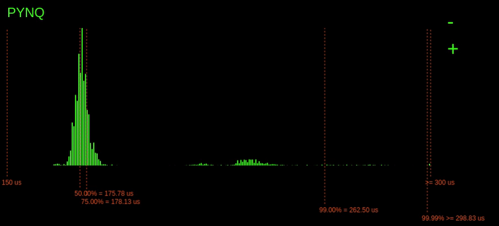
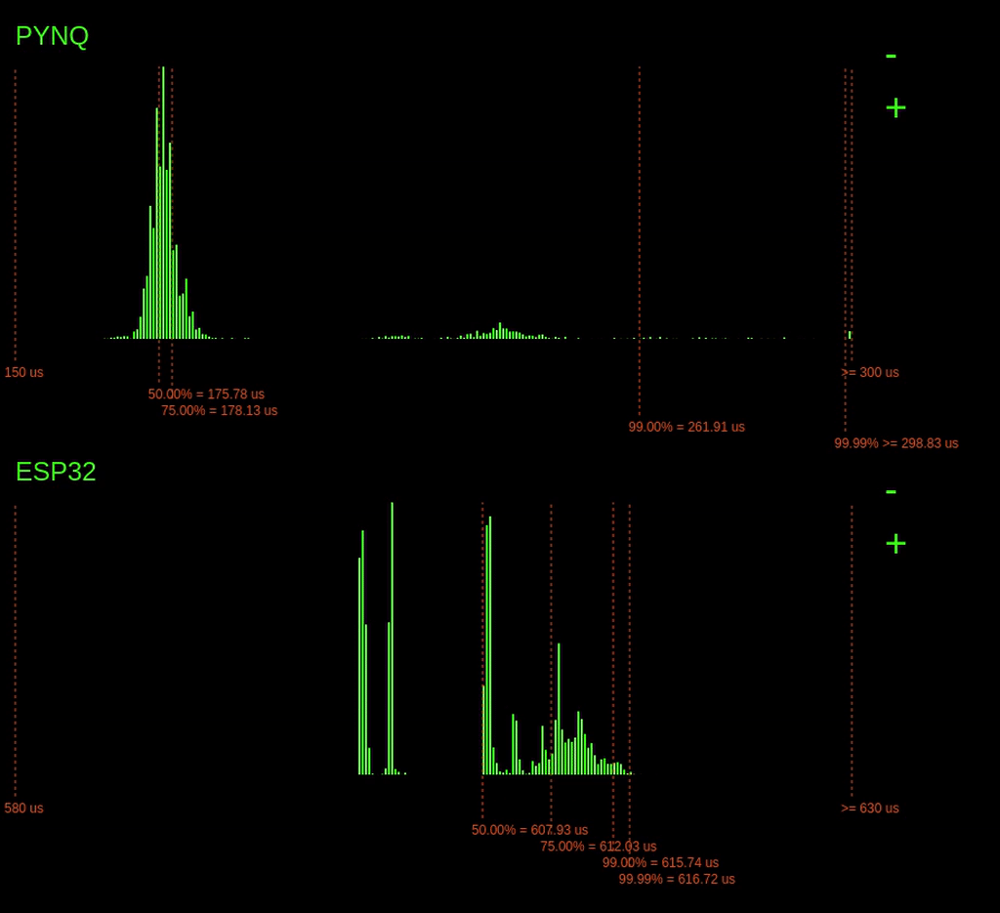
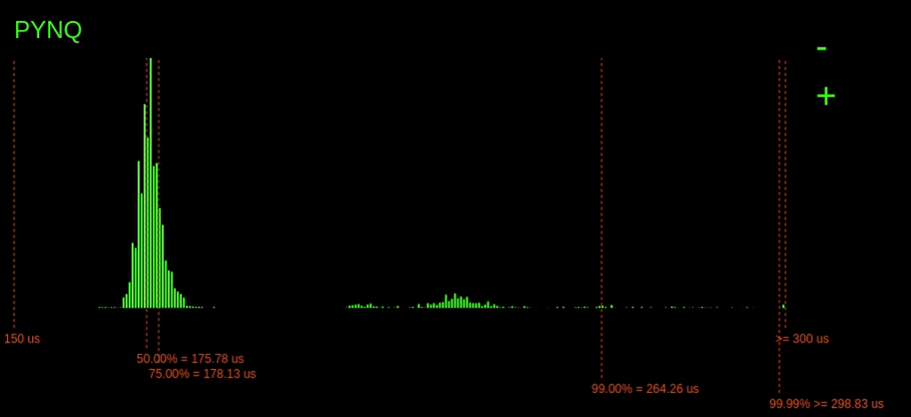

# EmSys: Worst Case Execution Time (WCET) and Real-Time Operating Systems (RTOS)

Imagine you've been asked to design an embedded systems for an aircraft, car, or a medical device.
These are embedded-systems where the operation of the device must be precise and correct.
One _very_ important consideration when designing a system is how long things take to execute.

Imagine you're responsible for designing part of an accelerator control system for a self-driving car. Your subsystem takes in readings from a LIDAR sensor, processes them, and sends the output to the accelerator controller. You may have quite a powerful microcontroller for your subsystem that can comfortably process the sensor data quickly and efficiently without too much trouble. However, if there is even a tiny chance that your system takes longer than it should, then you can have a big problem.

If your subsystem takes too long to process, it may result in a danger to life. Okay, but there are always risks in these things; what if any sort of delay is incredibly rare? Even if this is the case, it can present a severe issue. Imagine the self-driving car you are working on is deployed millions of times and runs for ten or more years. Suddenly the probabilities of even those very rare-events are starting to creep up, and any danger to life is unacceptable when we can design to avoid it.

__When designing such embedded systems it is crucial that:__

1. Tasks need to execute with precise timing guarantees
2. Embedded systems need to respond to external events with predictable timings

To make safe embedded systems, we need to ensure that our devices behave predictably concerning timing. To do that, we need to look into where unpredictable delays creep into typical systems and make the execution time non-deterministic.

A deterministic program is usually one where the program's outputted data is the same every single execution. However, with real-time systems, we take a stricter view on determinism and say that:

__The systems outputted data _and the timings of the outputs_ should be the same every execution__

Our desktop computers are throughput orientated machines. They aim to get the most work done in a given time. If we have many tasks, the computer can execute them in an arbitrary order to maximise the most output. Typical machines are also __abstracted__ to hide the system's timings to relieve the programmer's burden. Think about it: when you read or write to a variable in your program, or access a pointer, do you ever need to care how long it takes to fetch it from the memory subsystem? It's all completely invisible to you.

For real-time systems, such as the self-driving car we discussed earlier, timing is essential. This requirement means that different abstractions are required. After looking at the sources of non-determinism in typical computer systems, we will look at something called a Real-Time Operating System (RTOS). An RTOS puts the programmer in control of the timings of tasks.

### Sources of non-determinism


Variations in execution time occur at all levels of the computer stack and in many different places. Some examples at various levels are:

1. OS scheduler: when deciding which task to execute when
4. In the Memory Hierarchy, for example, caching
3. I/O Arbitration
5. Internally within the CPU: branch prediction, speculative execution

Let's dig into a few of these in a bit more detail; unfortunately, we don't have time to explore everything that can introduce non-determinism __(that would take a while).__

### OS Scheduler

Linux uses something called the __Completely Fair Scheduler__ ([CFS](https://en.wikipedia.org/wiki/Completely_Fair_Scheduler)), which we won't go into the details of here. But the basic principles are that we have multiple processes, and the scheduler allocated processes to hardware CPUs trying to give all the processes an equal amount of resources.

The problem with this approach is that it treats all processes equally and fairly. Doing things this way is great for a desktop environment, where we are trying to maximise the throughput of all the processes we have, i.e. do the most work with the limited hardware we have. However, where this approach is a hindrance is when we have tasks that do have higher priority and that have latency requirements over other tasks. 

When we have these sorts of requirements, as we often do with embedded systems, we need a Real-Time Operating System (RTOS) that considers tasks priority. We will go into the RTOS details in a little while.

### Memory Hierarchy


A stark tradeoff exists in computer systems between data storage volume and access speed and cost. Managing the variation in access speeds can cause __huge__ variations in execution time latency.

For instance, usually there is some high-speed SRAM memory that lives very close to the processor; however, typiucally, it's size is in the order of KBs or MBs. On the other hand, magnetic-disk based hard drives are a glacially slow storage medium, but their size is in the order of TBs.

To put this tradeoff in perspective, let's consider an analogy. Let's say that accessing data from our fast SRAM close to our processor is equivalent to travelling from the Computational Foundry to the Bay Library to check out a book.


Okay, great, that didn't take too long. Now let's say that what we are looking for isn't in our fast SRAM, and instead, we have to go to System Memory (the RAM of our machine). If going to SRAM is the same as travelling to the Library, then going to System Memory is the same as travelling to Bridgend.


Now, say we can't find what we are looking for in system memory (system RAM), we need to start going to solid-state drive (SSD) storage to look for our item. Intel has recently released some blazingly fast SSDs based on a technology called 3D XPoint; let's imagine we're lucky one of these devices. Accessing this is the equivalent to going to Bergen, Norway.


Okay, let's imagine that we are not so lucky, and we just have a standard run-of-the-mill SSD. Instead of travelling to Bergen, we're now travelling to Manilla.


Now, instead of an SSD, consider if we had a magnetic disk-based Hard Disk Drive. Then accessing our data would be the equivalent twice the distance to Mars.


This memory hierarchy is often shown as a pyramid that as you go up, you get increasing cost and performance, and as you go down, you get increased volume.


At the very bottom of the pyramid, I have included remote storage. Remote storage is becoming increasingly a concern for IoT style embedded systems that send their data to the cloud for storage.

### Managing the memory hierarchy

Generally to manage this memory hierarchy we use something called caching, where we store recently used items in the faster access memory. Caching, introduces big variations in execution time, if the item is in the cache then we get a short execution time, if it's not in the cache, the execution time can be very long.

Let's consider the top level of the memory hierarchy, the fast SRAM memory close to the processor.

Say we are loading an item __x__ from memory


First we check the fast access memory for __x__


If the item is not in the cache then we need to go to system memory (DDR)


We fetch the item from system memory (DDR) and load it into the cache


Then if a little later on we request __x__ again, then it hits in the cache and accesses it much faster.


Thinking again about the scales discussed previously:
* A cache hit is like walking from the Computational Foundry to the Bay Campus library to check out a book
* A cache miss is like walking from the Computational Foundry to Bridgend to check out a book

No wonder cache's have a big impact on execution time variation.

### Internally within the CPU

It's not just memory and I/O that can introduce non-determinism in the execution time of a task.
It's also possible to introduce it from within the CPU itself.


CPUs are generally organised a bit like a conveyor belt.                               
Instructions flow from left to right, and each unit does a little bit of work on each instruction as it passes through.
At any moment in time, each unit in the CPU will be working on a different instruction; this is something called pipeline parallelism.
The image above is a simple 5-stahge pipeline, where the stages are:

1. Fetch: fetches the next instruction from the instruction memory
2. Decode: decodes the instruction and fetches data from internal registers        
3. Execute: perform an operation with the ALU, such as add some numbers, or subtract 
4. Mem: send a read or write operations to memory
5. Write back: writes data back into the registers of the CPU

One optimisation in many modern CPUs is something called speculative execution.
Let's consider the following code:

```C
if(x > 10) {
        branch_1();
} else {
        branch_2();
}
```

If we fetch the instructions for the corresponding branch for ```if(x > 10)```, then we won't know what the following instructions are until the end of the __Execute__ stage of the processor pipeline.
There are two things that you can do:

1. stall the pipeline behind the ```if( x > 10)``` until we know the outcome   
2. guess and start fetching instructions

The guessing approach is called branch prediction, and modern CPUs are surprisingly good at it.
. 
CPUs will use previous information on branches to make good guesses and keep the conveyor belt full and moving smoothly; the problem is when they guess incorrectly.
After guessing incorrectly, the pipeline needs to be flushed, removing the incorrect instructions. Fixing this can take time and introduce delays.

__So, that's another source of execution time variance. When we guess correctly, we go slightly faster than when we are incorrect.__

Admittedly, this is a tiny performance boost compared to caches. The performance gains from caches are __gigantic__.

## Demonstration

We are going to compare the execution of a benchmark function on two different platforms.

1. An dual-core (800MHz) ARM processor running Linux
2. Our ESP32 (240MHz) device                    

The benchmark we will use is a matrix-vector multiplication, a typical operation used in machine learning applications or signal processing. 

Our benchmark code looks like this:

```C
volatile float rvec [125];
volatile float rmat [125][125];
float res [125];

void matVecMul(){
  for(int i=0; i<125; i++) {
    res[i] = 0.0;
    for(int j=0; j<125; j++) {
      res[i] += rvec[j] * rmat[i][j];    
    }
  }
}
```

This function is a reasonably compute-intensive operation. We need to iterate over the entire matrix and multiple each element in the matrix row, with each element in the column of the vector, accumulating the result in the returned vector.


__Don't worry if you don't follow the maths of this, it's just an example function we are using__

## Experimental Setup

As stated earlier, we will examine the execution time variance on two different embedded systems, an ARM-based system running Linux (PYNQ) and the TinyPico.


Each device connects to my home network. The PYNQ connects to the router via ethernet, as the ESP32 transfers data over WiFi.                                  
Each device will execute the same benchmark. The execution time is measured, and each device sends its measurement via WebSockets to a central server. The server renders a dynamic histogram for each devices execution time.
The timer code only times the benchmark execution; none of the transfer time is captured or measured.

## PYNQ Experimental setup

Running the benchmark on the PYNQ board produces the following real-time histogram of the execution time latencies:



The dashed lines show the different percentiles, i.e. the 75% line indicates that 75% of the latencies are to the left of the line, and 25% are to the right.

We can see there is quite a considerable variation in execution time here. There seems to be a peak above the 75% mark; this could due to other processes coming in and consuming CPU time.

It is also possible to see that the highest bin is quite full; this means that there are probably a couple of latencies that go off the chart (explored later).

When we start the experiment on the ESP32, the following histogram gets added below:



The results from the ESP32 are noticeably different from the PYNQ results. Here, we can see a variance in execution time of maybe 25us, whereas on the PYNQ, it varies wildly, >250us.

Notably,  for the ESP32, the tail latency (99.99% point) is quite tight with the rest of the latencies, meaning that in the worst-case, the execution time is not much worse than the average case. 

However, we do see that overall the ESP32 is considerably slower than the PYNQ. This slower speed makes sense. The PYNQs ARM CPU operates much faster; it runs at 240MHz instead of 800MHz. The ARM CPU is also a bigger, more complex processor with bigger caches. 

Remember I said that the PYNQ latencies went off the chart. Let's zoom out to find out just how far they go.


Zooming out, we can see that occasionally the 99.99% point goes quite far out reaching over 465us!

### Pinging the devices a lot

Both devices connect to the network, and we can send network packets to them. When a network packet is received, the CPU will need to perform some tasks to process them.                                                                        

Let's pretend that we are an attack trying to influence the functionality of an embedded system. We don't have access to the embedded system, but we have access to the network it is attached to, and we know the target devices IP address.

With this simple command, we can issue a flood of ping requests to the device, sending network packets as fast as we can:

```sh
    ping -f 192.168.0.101
```

As the embedded system processes these packets, it will have fewer CPU cycles to spare on processing the critical task, and the critical tasks execution time might increase.

Look at the histograms below when the ``ping -f`` command is issued and observe how the 99.99% latency point changes for the PYNQ device.


Interestingly, when the command is issued, we can see a considerable increase in the 99.99% latencies for the PYNQ board, but the ESP32 barely changes. On the ESP32,  a small increase in 99.99% of just 1us, unlike the PYNQ, which increases by over 400us.

Why is the ESP32s latency not affected as much by the ping flood? The answer is because of the operating system on the ESP32. The ESP32 is running a Real-Time Operating System (RTOS). This RTOS schedules tasks differently from the Linux scheduler. On an RTOS, it's possible to assign tasks hard priorities, enabling them to take preference over other tasks. This prioritising allows our tasks execution to be barely affected by the increase in network traffic. However, the completely fair scheduler of Linux is trying to balance the load for all the system tasks, including processing the useless incoming network packets. Since the Linux scheduler is trying to do things fairly, this eats into the processing time allocated for our tasks, increasing its worst-case execution time.

Imagine a situation where we have constructed a self-driving car. In many of these complex systems, there are local networks that connect various embedded systems and modules. We don't need access to the system to effect it. We could place devices within the network that generate network traffic, seriously disrupting the victim system, causing it to miss deadlines, and potentially endangering lives.

### Logging in via ssh

Of course, if the attacker does have access to the PYNQ device, they can seriously disrupt our task's execution time. Look what happens when a user connects in via ssh:



## Real-Time Operating Systems (RTOS)

A Real-Time Operating System (RTOS) is typically a lightweight operating system for embedded devices that enable multiple tasks to share the same hardware resources while providing the developer control over tasks' timing. 

The two critical components of an RTOS are the tasks and the scheduling ticks.


Tasks are a unit of functionality. You can think of them as similar to an ISR; however, they do not have some of the same restrictions. For instance, you can have quite large tasks as ISRs should be kept small. Some example tasks could be periodically encrypting a buffer full of data or occasionally blinking and LED.

Tasks in an RTOS have a few states that they can be in any given moment in time:
* They can be __running__: in which case they have been allocated a CPU and are executing.
* They can be __ready__: they have indicated to the RTOS that they are prepared to run, but are not currently running on a CPU.
* Or they can be __blocked__: they are waiting on a timer, or perhaps some external I/O and cannot run until that occurs.


The next main component of an RTOS is the tick, an ISR that executes periodically. A hardware timer on the MCU generates the interrupt that triggers the ISR. It is the responsibility of this ISR to schedule tasks onto processors.


Every "tick", the ISR will look at the tasks available and the currently running tasks and decide whether to swap what is presently running on the core.


Remember that tasks can either be running, ready, or blocked. The RTOS scheduler will look at all the running tasks and all the ready tasks and decide whether to swap a running task with a ready task. These scheduling decisions are often configurable, with different tradeoffs. However, the most common scheduling approach for an RTOS is __Fixed-Priority Preemptive Scheduling__.

### Fixed-Priority Preempive Scheduling


Let's start with preemptive scheduling, which means that the operating system can swap what is executing on a given core with a different task. For instance, say task T1 is running on a CPU, then preemption means that before the T1 has completed, the RTOS can pause it, remove it from the core, and load T2 instead. T1 can then be resumed at a later point. Preemption is excellent because it allows us to have multiple tasks sharing the same hardware. However, we need to be careful. Swapping tasks, called a context switch, has overheads similar to the overheads of calling an ISR if we do it too frequently, then we will be wasting time and energy.


So RTOSs are usually preemptive, but they also have some notion of priority. Priority is what gives the developers control of the timing over the execution of the task. The example above shows T1 and T2 now assigned with priorities 5 and 0, respectively. With fixed-priority  preemptive scheduling, we restrict the preemption such that only a higher priority task can preempt a lower priority task. This example would mean that T1 can preempt T0; however, T2 cannot preempt T1.  Having a priority allows us to guarantee that certain critical tasks will complete in a tighter bounded amount of time. They are guaranteed to take control of the CPU, no matter what other tasks are executing.


Having priorities gives us a lot of control, but isn't there a danger? Won't the highest priority task take control over the CPU and starve all other tasks from executing?

Preventing the starvation of tasks is where the notion of blocking comes into play. Blocking is where a task must voluntarily release control of the CPU to allow other tasks to execute. It is also something that the embedded system developer must explicitly think about when designing the system. There are two primary ways for a task in an RTOS to block:


Tasks can block by either going to sleep or waiting for an event or message. When a task goes to sleep, it places it into a blocked state for a finite number of RTOS ticks, allowing another task to execute. When the amount of ticks elapses, the RTOS, during the scheduling ISR, will wake up the task and change its state to ready. The other way a task can block is waiting for a message from another task; or an event, like I/O being made available.

### Example

Let's consider an example:


Say we have three tasks, T1, T2, and T3. Each of these tasks has priorities 5, 3, and 0, respectively. 

* T1 enters an infinite loop ``while(true)`` and then calls a function to collect some data with ``getData()``. It then goes to sleep for 1000 ms (1s), placing it in a blocked state.

* T2 also enters an infinite loop where it calls a function to process the gathered data ``processData()``. It then goes to sleep for 3000 ms (3s).

* Finally, T3 also enters an infinite loop where it calls a function that flashes an LED; it never sleeps and never enters a blocking state.


Let's say that initially, T3 is executing, and it is blinking the LED for 1 second.


After 1s, T1 wakes up and gets scheduled on the cores, preempting T3, as it has a higher priority than T3. Once it has finished executing, it goes to sleep, and T3 resumes running from where it left off.


After another 1s the same thing happens again: T1 wakes up, preempting T3.


Finally, after 3s, T2 is ready to wake up. However, at this point, T1 wakes up also. Since T1 has a higher priority than T2, it takes control of the processor first. Once it finishes, T2 can then execute before finally allowing T3 to run.


An RTOS is a powerful and useful abstraction to use when designing embedded systems. They abstract a lot of the task management, are simpler and safer to use than ISRs, and only require a single timer to schedule multiple tasks with real-time constraints.


An RTOS is a powerful and valuable abstraction to use when designing embedded systems. They abstract away a lot of the task management, are simpler and safer to use than ISRs, and only require a single timer to schedule multiple tasks with real-time constraints. However, care still must be taken. It is the programmer's responsibility to correctly implement tasks appropriately and ensure that tasks block preventing other tasks from being starved.
